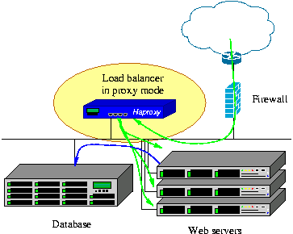

# HAProxy

## Sobre o HAProxy

O HAProxy é uma solução gratuita, rápida e confiável, que oferece alta disponibilidade, balanceamento de carga e proxy para aplicativos Web.

É amplamente utilizado em sites de tráfego intenso, e alguns são sites mais visitados do mundo.

Ao longo dos anos, tornou-se o balanceador de carga default fornecido com a maioria das distribuições Linux, além de geralmente ser implantado por padrão em plataformas de nuvem.

Como o HAProxy não anuncia a si mesmo, só sabemos que ele está em uso quando os administradores informam :-)

Seu modo de operação torna sua integração em arquiteturas existentes muito fácil e sem riscos, enquanto oferece a possibilidade de não expor servidores frágeis à rede:



## Balanceamento de carga

O balanceamento de carga consiste na agregação de vários componentes para obter uma capacidade de processamento total acima da capacidade individual de cada componente, sem qualquer intervenção do usuário final e de forma escalonável.

Exemplos de balanceamento de carga:

- Agendamento de processos em sistemas com vários processadores
- Balanceamento de carga de link (por exemplo, EtherChannel, Bonding)
- Balanceamento de carga de endereços IP (por exemplo, ECMP, round-robin de DNS)
- Balanceamento de carga do servidor (via balanceadores de carga)

Em ambientes da Web, esses componentes são chamados de "balanceador de carga de rede", pois essa atividade é, de longe, o caso de uso mais comum.

## Implantação do HAProxy

```bash
# Configurações globais

global
        log         127.0.0.1 local2

        chroot      /var/lib/haproxy
        pidfile     /var/run/haproxy.pid

        maxconn     4000 # Quantidade máxima de conexões globais. O ideal é realizar um teste de carga para definir este número

        user        haproxy
        group       haproxy
        daemon

        stats socket /var/run/haproxy/info.sock mode 666 level user # Habilita estatísticas via socket para o monitoramento

defaults
        mode                    http
        log                     global
        option                  httplog
        option                  dontlognull
        option                  dontlog-normal
        option                  log-separate-errors
        option                  http-ignore-probes

        option                  redispatch
        retries                 3
        timeout http-request    10s
        timeout queue           2m
        timeout connect         10s
        timeout client          10m
        timeout server          10m
        timeout http-keep-alive 20s
        timeout check           10s
        maxconn                 3000

        option forwardfor

# Frontend HTTP redirect
frontend http
        bind *:80
        mode http

        acl is_reverseproxy hdr_sub(host) -i <FQDN>

        redirect scheme https code 301 if !{ ssl_fc } !is_reverseproxy

        use_backend reverseproxy if is_reverseproxy

# Frontend https
frontend https
        bind *:443 ssl crt /etc/ssl/private/wildcard.pem
        mode http

    acl is_reverseproxy hdr(host) -i <FQDN>

    use_backend gampes if is_gampes
        use_backend reverseproxy if is_reverseproxy

backend reverseproxy # Defina múltiplos backends a partir daqui
        balance roundrobin
        mode http
        option forwardfor
    http-request set-header X-Forwarded-Port %[dst_port]
        http-request add-header X-Forwarded-Proto https if { ssl_fc }
        server HOSTNAME IPADDR:PORT # É possível assinalar múltiplos servidores
        server HOSTNAME IPADDR:PORT

# Provê um ponto de estatísticas do HAProxy
listen haproxy-monitoring
        bind    *:9090
        mode    http
        stats   enable
        stats   show-legends
        stats   hide-version
        stats   show-node
        stats   refresh           10s
        stats   uri               /
        stats   realm             Haproxy\ Statistics
        stats   auth              monitor:monitor
        stats   admin             if TRUE
```
