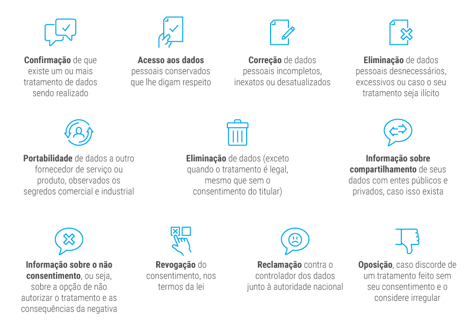
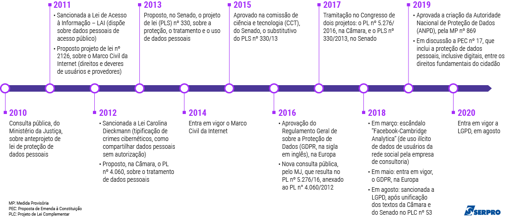

# LGPD

## Objetivo da LGPD

A LDPG tem como principal objetivo empoderar o consumidor e garantir a indenização na ocorrência de danos causados ao dono original dos dados coletados, ou seja, o usuário.

## Resumindo a LGPD

Através da Lei 13.709/18 (14/08/2018), o Brasil passou a fazer parte do grupo de países que possuem uma Lei Geral de Proteção de Dados. Sua proposta inspirada na legislação europeia, a General Data Protection Regulation (GDPR).

A LGPD estabelece bases legais para legitimação do tratamento de dados pessoais e garante direitos aos titulares dos dados como: acesso, correção, eliminação, portabilidade e revogação do consentimento.

O tratamento desses dados deve considerar os princípios de privacidade descritos na lei, exigindo atenção especial a dados pessoais de crianças e adolescentes, que requerem também o consentimento de um dos pais antes da coleta dos dados.

A Autoridade Nacional de Proteção de Dados Pessoais (ANPD) pode, a qualquer momento, solicitar relatórios de riscos de privacidade para certificar-se do cumprimento da Lei.

Empresas devem garantir a segurança dos dados pessoais tratados. Em caso de incidentes de segurança da informação (como roubo ou vazamento indevido de dados de usuários), devem comunicar à ANPD imediatamente.

Em casos de descumprimento da Lei, as empresas podem pagar multas que variam de 2% do faturamento bruto até R$ 50 milhões **por infração**.

As empresas passam a ter até fevereiro de 2020 para se adequar às exigências da Lei, que será posta em prática em agosto de 2020.

Processos já implementados para atender a GDPR podem ser adaptados para a LGPD

## Desafios de gestão e governança de privacidade

- Gestão de consentimentos e revogações
- Gestão de petições abertas por titulares
- Gestão do ciclo de vida dos dados pessoais (data mapping & data discovery)
- Implementação de técnicas de anonimização (os dados anonimizados não serão considerados dados pessoais pela lei desde que o processo não seja reversível)

## Motivadores da Lei

### Caso Cambridge Analytica

- Compra de informações pessoais coletadas por um app externo ao Facebook
- Usuários do app deram seu “OK” para que seus dados fossem utilizados para fins acadêmicos
- Estes usuários não faziam ideia de que seus dados seriam usados nas eleições americanas de 2016

1. A venda ou uso dos dados para propaganda era proibida pelo Facebook, mas não havia controle sobre seu uso
2. Informações pessoais foram usadas para fins políticos sem consentimento
3. Cerca de 50 milhões de usuários tiveram dados coletados sem autorização
4. O Facebook nega o mau uso de informações dos seus usuários até hoje

**O caso da Cambridge Analytica impulsionou a aprovação da LGPD. A Cambridge Analytica planejava atuar nas eleições brasileiras de 2018, expondo assim a necessidade de ter uma lei que regulasse o tratamento de dados pessoais.**

## Como funciona o tratamento de dados pessoais com a LGPD

- Regulamenta o tratamento de dados pessoais
- Delimita a linha entre o tratamento legal e ilegal de dados por uma empresa
- Evita brechas para manipular dados pessoais

Algumas dessas justificativas para tratamento de dados devem ser destacadas:

### Consentimento

- O consentimento dado pelo usuário como justificativa para permitir o tratamento de seus dados pessoais deve ser inequívoco
- A cláusula para consentimento não deve vir entrelinhas de termos e condições intermináveis
- Deve estar claro para o usuário que ele está permitindo o tratamento de determinados dados por terceiros
- Tirando as situações previstas na Lei, é o usuário quem define se seus dados pessoais podem ou não ser tratados por terceiros
- O usuário deve autorizar que suas informações sejam usadas, por empresas e órgãos públicos, na hora da oferta de produtos e serviços, gratuitos ou não

Com a nova lei fica claro que o verdadeiro dono do dado não é aquele que o utiliza, nem aquele que o salvaguarda em bancos de dados. O dado pessoal é estritamente da pessoa a quem ele diz respeito. Na teoria isso parece algo óbvio, mas na prática não é bem assim. E tem muito dado particular sendo usado para fins que seu dono ou dona real sequer sabem. Usos, inclusive, que podem até mesmo prejudicá-los.

#### Consentimento na prática

Imagine que você autorizou que seus dados fossem empregados por uma organização: essa deverá pedir nova permissão sua, e especificamente para o novo fim, caso ela deseje compartilhar os dados com outras organizações - ressalvadas as hipóteses de dispensa do consentimento previstas na LGPD.

E o seu consentimento deve ser para finalidades determinadas. Isso significa que se te pedirem - para tratar dados - de uma forma muito genérica, sem especificações, o pedido e sua posterior autorização serão considerados nulos.

Vale lembrar que você pode revogar, a qualquer momento, um consentimento cedido anteriormente. E caso a organização altere informações no decorrer do tratamento dos dados, você deve ser avisado sobre isso - e poderá revogar o consentimento, caso não concorde com a alteração.

Quando tratar dados pessoais for condição para fornecimento de produto ou serviço ou para exercício de um direito, você deve ser avisado sobre isso e sobre os meios pelos quais pode exercer seus direitos como titular. E se as informações fornecidas tiverem conteúdo enganoso ou abusivo, ou não forem apresentadas previamente com transparência e clareza, o consentimento será considerado nulo.

Além disso, quando forem feitas mudanças, na finalidade de um tratamento, não compatíveis com o consentimento original, o gestor dos dados deverá informar isso previamente, e dar a opção de revogar o consentimento, se você discordar das alterações propostas. A oposição deverá ser feito mediante manifestação expressa, por meio de procedimento gratuito e facilitado.

### Proteção de crédito

- **Antes da LGPD**: sistema opt-out, aonde um banco já possuem os dados do cliente comunicados entre bancos sem que haja consentimento do cliente
- **Depois da LGPD**: sistema opt-in, aonde o cliente deve conceder permissão para que seus dados sejam comunicados entre bancos

### Interesse legítimo

"O tratamento de dados pode ser feito se houver interesse legítimo de um responsável ou terceiro" - Tal justificativa causa ambiguidade na lei porque, não se sabe ao certo o que seria considerado interesse legítimo.

## Direitos do usuário

A LGPD se preocupa em garantir a privacidade e controle de dados pelo próprio usuário, brasileiro ou não, que esteja no Brasil. É importante conhecer desde já esses direitos para poder exercê-los a partir de agosto do próximo ano, quando a LGPD entra em vigor e passa a valer efetivamente no país.

Todo usuário tem o direito de:

## Penalidades para empresas

Caso uma empresa gerencie bases de dados pessoais ou faça algum tipo de tratamento de dados pessoais, coletados no território brasileiro, para fins econômicos com o objetivo de ofertar produtos e serviços, será preciso se adequar à LGPD.

Caso utilize dados pessoais apenas para fins acadêmicos, artísticos ou jornalísticos, não será necessário se adequar

Caso uma empresa não cumpra a Lei, as seguintes penalidades podem ocorrer:

- Proibição total ou parcial de atividades relacionadas a tratamento de dados
- Prejuízos financeiros à empresa em forma de multas (até 2% do faturamento da empresa ou conglomerado limitado até R$ 50 milhões por infração cometida)
- Caso haja vazamento de dados, uma infração pode ser interpretada como **cada** dado pessoal vazado.
- Há possibilidade de multas diárias para compelir a entidade a cessar as violações

Mais que multas que afetam o caixa, não aplicar a Lei pode abalar a reputação diante dos clientes e a confiança em seus produtos e serviços.

### Alguns ramos mais impactados

- Software e tecnologia
- Direito e advocacia
- Financeiras e seguradoras
- E-commerce
- Pesquisa e perfilamento
- Planos de saúde
- Publicidade e marketing

## Benefícios para empresas

A adequação necessária para atender a nova regulamentação, pode ser considerada sinônimo de custos as empresas, cujo prazo para entrar em vigor é Agosto de 2020.

Entretanto, é possível entender a legislação como algo positivo, por trazer benefícios, como, por exemplo:

- Melhora no relacionamento com cliente através da confiabilidade e respeito à privacidade
- Aumento da segurança jurídica para atuar através de dados pessoais
- Segurança cibernética aprimorada e para usos determinados
- Valorização do marketing e aumento de sua produtividade

A Lei Geral de Proteção de Dados tem potencial para motivar muitas mudanças as empresas que tratam dados pessoais. Os negócios que se adequarem antes do tempo previsto terão a oportunidade de ajustar seus processos para colher bons frutos da regulamentação, visando sua reputação a longo prazo.

Uma nova cultura de proteção e privacidade de dados pessoais deve ser estabelecida, com mudanças significativas no gerenciamento desses dados, com maior organização, controle, centralização de dados adequados, minimizados e que possuam alto potencial na criação de insights estratégicos, com o refinamento dos processos de tratamento e utilização, possibilitando vantagem competitiva nas companhias que não esperarem o tempo máximo para se adequarem a legislação, e trazendo a possibilidade de trabalharem com informações mais limpas, adequadas e apoiadas em bases legais.

## Como empresas podem aderir à LGDP

### Nomear agentes técnicos

A LGPD prevê agentes de tratamento de dados pessoais:

- **Controlador**: a quem compete as decisões relativas ao tratamento dos dados
- **Operador**: quem realiza o tratamento, em nome do controlador
- **Encarregado**: responsável por atender as demandas dos titulares, interagir com a ANPD e orientar funcionários e contratados quanto às práticas de proteção de dados pessoais

### Gerir os dados e respeitar a privacidade

Identificar, entre as informações que gerencia, quais são dados pessoais (e também se há dados sensíveis sobre crianças e adolescentes). Verificar os meios em que se encontram (físico ou digital). A empresa deve tratar os dados levando em conta os princípios determinados pela Lei (finalidade, adequação, livre acesso, qualidade dos dados, transparência, prevenção, não discriminação, responsabilização).

Atenção ao consentimento e à guarda de provas. O titular deve concordar, de forma explícita e inequívoca, que seus dados sejam tratados pela empresa.

### Bases legais

"Consentimento" é a palavra-chave da LGPD.

De modo geral, não se pode enviar ofertas caso o consumidor não permita isso explicitamente.

Exceções em que não é preciso o consentir:

- a uma obrigação legal
- a políticas públicas
- a estudos via órgão de pesquisa
- a um direito, em contrato ou processo
- à preservação da vida e da integridade física de uma pessoa
- à tutela de procedimentos feitos por profissionais das áreas da saúde ou sanitária
- à prevenção de fraudes contra o titular
- à proteção do crédito
- a interesses legítimos da empresa, desde que esses interesses não firam direitos fundamentais do titular

### Apoio e prevenção para sua infraestrutura

- Engajar a diretoria e colaboradores em práticas de tratamento de dados
- Conhecer boas práticas, participar de cursos de formação, entre outras ações
- Elaborar e adotar normas de governança para tratamento de dados, medidas preventivas e de segurança
- Replicar boas práticas e certificações aplicadas no mercado.
- Construir planos de contingência para tratar incidentes de segurança e tratar os problemas com agilidade
- Fazer auditorias regularmente

### Transparência e proatividade

- Ser ágil no atendimento aos pedidos do titular dos dados, segundo os critérios definidos pela LGPD e pela ANPD
- Caso tenha ocorrido, comprovadamente, dano patrimonial, moral, individual ou coletivo, responda por eles
- Atenção às questões sobre quando encerrar um tratamento e informe sobre o término ao titular.

### Extraterritorialidade

A LGPD se aplica a empresas que ou têm estabelecimento no Brasil, e/ou oferecem produtos e serviços ao mercado brasileiro, e/ou coletam e tratam dados de pessoas que estejam no país.

Vale lembrar que não importa:

- Se o titular dos dados é brasileiro ou não
- Qual o meio de operação de tratamento dos dados (físico ou digital)
- Qual o país sede da empresa
- Se os dados estão hospedados em datacenters no país ou não

Vale reforçar que a LGPD permite a transferência de dados além-fronteira, desde que seja:

- Com o consentimento específico do titular
- Aa pedido do titular para que esse possa executar pré-contrato ou contrato
- Para proteção da vida e da integridade física do titular ou de terceiro
- Para ajudar na execução de política pública
- Para país ou organismo internacional que projeta dados pessoais de forma compatível com o Brasil
- Para cooperar juridicamente com órgãos públicos de inteligência, investigação, ou por conta de compromisso assumido via acordo internacional
- Para cumprir obrigação legal
- Com a autorização da ANPD
- Comprovado que o controlador segue a LGPD na forma de normas globais, selos, certificados e códigos de conduta

### Avanço do Brasil em proteção de dados pessoais

Confira a linha do tempo da LGPD no país. Há sim conquistas a comemorar. Porém, ainda há muitos desafios a resolver.

## Regulamentação da LGPD

A fiscalização e a regulação da LGPD ficarão a cargo da Autoridade Nacional de Proteção de Dados Pessoais (ANPD). A ANPD será ainda um elo entre sociedade e governo, permitindo que as pessoas enviem dúvidas, sugestões, denúncias ligadas à LGPD para apuração.

Terá também um importante papel de orientadora e de apoiadora dos órgãos de governo e empresas em relação às situações em que elas podem ou não tratar dados pessoais do cidadão.

A proposta da ANDP é orientar preventivamente, fiscalizar, advertir e, somente após tudo isso, penalizar se a Lei continuar sendo descumprida.

### Autonomia

A  ANPD está em processo de formação, e será vinculada à Presidência da República, com autonomia técnica garantida pela lei.

A autoridade contará com o Conselho Nacional de Proteção de Dados Pessoais e da Privacidade, composto por 23 titulares não remunerados, com mandato de dois anos, e de diferentes setores:

- 6 do Executivo Federal
- 1 do Senado Federal
- 1 da Câmara dos Deputados
- 1 do Conselho Nacional de Justiça
- 1 do Conselho Nacional do Ministério Público
- 1 do Comitê Gestor da Internet no Brasil
- 4 da sociedade civil com atuação comprovada em proteção de dados pessoais
- 4 de instituição científica, tecnológica e de inovação
- 4 de entidade do setor empresarial ligado à área de tratamento de dados pessoais

### Ambiguidade

Algumas partes da LGPD são ambíguas e podem resultar em interpretações que podem custar muito a uma empresa. Por isso, há necessidade da Agência Nacional de Proteção de Dados (ANPD) regular e clarificar essa lei para organizações.

## GDPR x LGDP

A LGPD é muito semelhante à GPDR em contexto, estrutura e racional final - para proteger os direitos e liberdades fundamentais das pessoas físicas, especialmente o desenvolvimento da personalidade das pessoas físicas. No entanto, suas diferenças tornam a lei única e, de certa forma, mais avançada que a GDPR. No entanto, o Brasil tem muito a aprender com o histórico e as perspectivas da proteção de dados na Europa. Sem dúvida, serão necessárias lições da UE para ler e interpretar cuidadosamente a lei brasileira.

É importante destacar que a LGPD possui uma técnica normativa diferente da GDPR. A lei brasileira é menos prescritiva e não tem considerandos como diretrizes para interpretar o texto jurídico.

Ambas as Leis incentivam claramente a adoção de códigos de conduta. Ambas dedicam um capítulo específico para especificar como os controladores e processadores podem contribuir para a aplicação correta da lei.

Quando comparada à regulamentação européia, a LGPD:

a) não calibra essa ferramenta regulatória com base no tamanho das empresas (micro, pequenas e médias), mas leva em consideração a categoria de dados, a finalidade e o escopo do processamento de dados. e, principalmente, quais são os riscos em jogo contra os titulares dos dados
b) é menos prescritiva que a GPDR, exemplificando que tipo de elementos devem ser abordados pelos códigos de conduta. O regulamento da UE possui 11 exemplos em comparação aos oito do LGDP.

Tópico  |   GDPR  |   LGPD
--------|---------|--------
Exceções à lei  |   Dados processados ​​por uma pessoa singular no curso de uma atividade puramente pessoal ou doméstica; e dados processados ​​pelas autoridades competentes para fins de prevenção, investigação, detecção ou repressão de infrações penais ou execução de sanções penais, incluindo salvaguardas e prevenção de ameaças à segurança pública.  |   Tratamento de dados por uma pessoa singular exclusivamente para fins privados e não econômicos; tratamento de dados se realizado exclusivamente para fins jornalísticos e artísticos; para fins acadêmicos; ou para fins de: a) segurança pública; b) defesa nacional; c) segurança do estado; ou d) atividades de investigação e repressão de infrações penais.
Âmbito territorial  |   Qualquer empresa que tenha uma filial na UE ou ofereça serviços ao mercado da UE e colete e trate dados pessoais de titulares de dados localizados na UE, independentemente da nacionalidade, estará sujeita à nova lei.  |   Qualquer empresa que tenha uma filial no Brasil ou ofereça serviços ao mercado brasileiro e colete e trate dados pessoais de titulares de dados localizados no país, independentemente da nacionalidade, estará sujeita à nova lei. Os fluxos de dados que são meramente transmitidos ao Brasil, mas não processados ​​posteriormente, não se enquadram no escopo da lei.
Dados pessoais  |   Qualquer informação relativa a uma pessoa singular identificada ou identificável (titular dos dados); uma pessoa singular identificável é aquela que pode ser identificada, direta ou indiretamente, em particular por referência a um identificador, como nome, número de identificação, dados de localização, identificador on-line ou a um ou mais fatores específicos de natureza física, fisiológica, identidade genética, mental, econômica, cultural ou social dessa pessoa natural.  |   Qualquer informação relativa a uma pessoa singular identificada ou identificável. Não há exemplos na definição trazida pela lei.
Dados anônimos  |   Fora do escopo da lei, foram levadas em consideração as medidas razoáveis ​​para se identificar novamente.  |   Fora do escopo da lei, foram levadas em consideração as medidas razoáveis ​​para se identificar novamente. Podem ser considerados dados pessoais se usados ​​para fins de criação de perfil.
Dados pseudonimizados  |   No âmbito da lei, uma vez que deve ser considerada informação sobre uma pessoa singular identificável.  |   Não definido por lei, exceto para pesquisas realizadas por órgãos de saúde pública.
Dados de integridade (dados confidenciais)  |   Atividades legítimas (sem fins lucrativos) e interesse público são a base legal.  |   A execução de um contrato é considerada uma base legal para o processamento.
Dados manifestamente tornados públicos pelo titular dos dados  |   Atividades legítimas (sem fins lucrativos) e interesse público são a base legal.  |   A execução de um contrato é considerada uma base legal para o processamento.
Processamento legal  |   Seis bases legais legais: (i) consentimento; (ii) obrigação legal; (iii) proteção da vida; (iv) interesse público; (v) desempenho contratual; (vi) e interesse legítimo.  |   Dez bases legais, que são: (i) consentimento; (ii) obrigação legal; (iii) implementação de políticas públicas pela administração pública; (iv) pesquisa por entidades públicas de estudo; (v) desempenho contratual; (vi) exercício de direitos em processos judiciais; (vii) proteção da vida; (viii) proteção da saúde; (ix) interesse legítimo; e (x) proteção ao crédito.
Interesse legítimo  |   Mais restritivo, necessidade de um teste de equilíbrio, fornecido pelos considerandos.  |   Possivelmente mais flexível, pois pode ser usado para "promoção" das atividades do controlador. Teste de equilíbrio fornecido pela lei e precisa ser documentado.
Consentimento  |   Deve ser uma indicação informada, inequívoca e livre do acordo dos titulares de dados para o processamento de dados como regra geral. Deve ser explícito no processamento de dados confidenciais e na transferência internacional de dados.  |   Deve ser uma indicação informada, inequívoca e livre do acordo dos titulares de dados para o processamento de dados como regra geral. Deve ser específico para o processamento de dados confidenciais e para transferência internacional de dados.
Solicitações de acesso do titular dos dados  |   Até 30 dias, a gratuidade é opcional.  |   Direito de acesso, até 15 dias. Outros direitos, tempo razoável, gorjeta é obrigatória (gratuita).
Revisão de decisões automatizadas  |   Necessário quando impactado, tem um efeito legal material sobre o titular dos dados. Limitado aos dados fornecidos por consentimento.  |   Presume-se um impacto no titular dos dados quando a tomada de decisão automatizada se baseia em criação de perfil; portanto, há o direito de revisar. Não se limita aos dados fornecidos por consentimento.
Responsável pela proteção de dados  |   Não é obrigatório para todos os controladores. As condições são estabelecidas pelo regulamento, como volume e tipo de dados processados, do uso de novas tecnologias e riscos para os titulares dos dados. O tamanho do controlador de dados não é uma condição. Não é obrigatório ser uma pessoa singular ou funcionário do controlador, pode ser uma entidade legal. Pode ser terceirizado, não sendo obrigatório estar localizado na União Europeia.  |   Obrigatório para todos os controladores, independentemente do tamanho, tipo e volume dos dados processados ​​e riscos para o titular dos dados (a provisão pode ser ajustada pelo DPA). Obrigatório para ser uma pessoa natural. Não é obrigatório ser funcionário do controlador, ele pode ser terceirizado. Não é obrigatório estar localizado no Brasil.
Representante de controladores não estabelecidos na região  |   O responsável pelo tratamento ou o processador deve designar por escrito um representante na União.  |   Não há necessidade de o controlador ou o processador designar um representante no Brasil.
Registro da atividade de processamento  |   Não é obrigatório para empresas com menos de 250 funcionários.  |   Obrigatório para todas as empresas (a provisão pode ser ajustada pelo DPA).
Registro de banco de dados no DPA  |   Não é necessário.  |   Não é necessário.
Notificação obrigatória de violação de dados  |   Os controladores precisam notificar os DPAs dentro de 72 horas.  |   Os controladores precisam notificar os DPAs e os titulares dos dados dentro de um prazo razoável (a provisão pode ser ajustada pelo DPA).
Códigos de conduta  |   Há um capítulo específico que: a) faz referência às necessidades específicas das micro, pequenas e médias empresas como diretrizes para a elaboração dos códigos de conduta; b) lista onze exemplos do que deve ser tratado por eles.  |   Há um capítulo específico que: a) faz referência à categoria de dados, ao objetivo e escopo do processamento de dados e, principalmente, quais são os riscos em jogo contra os titulares dos dados e os benefícios para eles como diretrizes para a elaboração dos códigos De conduta; b) lista oito exemplos do que devem ser abordados por eles.
Avaliação de impacto na proteção de dados  |   Há um capítulo específico e a obrigação de executar uma DPIA no caso de o processamento de dados resultar em alto risco na ausência de medidas tomadas pelo controlador para mitigar o risco.  |   Não existe um capítulo ou dever específico para executar uma DPIA. No entanto, um DPIA pode ser obrigatório em situações já caracterizadas como arriscadas ou, a pedido da autoridade, onde o processamento de dados se baseia em interesses legítimos.
Finais  |   Até 4% da receita global do grupo econômico, até 20 milhões de euros.  |   2% da receita do Brasil, até R $ 50 milhões por infração. Possível penalidade diária para garantir o cumprimento.
Autoridade de proteção de dados  |   Definido e estabelecido em nível nacional.  |   Indefinido e ainda a ser estabelecido pelo novo presidente, em nível nacional.
Fluxo de dados internacionais  |   Necessidade de decisão de adequação para transferir livremente dados para outros países. Em caso de falta de adequação, os instrumentos legais são fornecidos pelo regulamento. Realizado legalmente com base em interesses legítimos, se incomuns.  |   Necessidade de decisão de adequação para transferir livremente dados para outros países. Em caso de falta de adequação, instrumentos legais fornecidos pelo regulamento. Não pode basear-se em interesse legítimo, consentimento expresso talvez uma base legal.
Período de adaptação    |   24 meses    |   18 meses, fevereiro de 2020. O DPA terá a palavra sobre como legitimar bancos de dados antigos.

## Conclusão

- A LGPD é um grande avanço no cenário de segurança de dados pessoais
- Assim como a GDPR, a LGPD tem aplicação extraterritorial
- Algumas partes da lei ainda são um pouco ambíguas e precisam de amadurecimento
- Assegura o controle e privacidade do usuário sobre seus dados pessoais
- Dita regras claras sobre como tratar dados pessoais e quais são os direitos do usuário
- Deve ser implantada em empresas até fevereiro de 2020

## Referências

- <https://www.planalto.gov.br/ccivil_03/_Ato2015-2018/2018/Lei/L13709.htm>
- <https://www.planalto.gov.br/ccivil_03/_ato2019-2022/2019/lei/l13853.htm>
- <https://www.pwc.com.br/pt/sala-de-imprensa/artigos/lgpd-muda-pratica-plc-53.html>
- <https://www.serpro.gov.br/lgpd>
- <https://tenbu.com.br/beneficios-da-lgpd/>
- <https://iapp.org/news/a/gdpr-matchup-brazils-general-data-protection-law/>
- <https://g1.globo.com/economia/tecnologia/noticia/entenda-o-escandalo-de-uso-politico-de-dados-que-derrubou-valor-do-facebook-e-o-colocou-na-mira-de-autoridades.ghtml>
