# Sobre os Serviços de Certificado

Os Serviços de Certificado Microsoft atua recebendo solicitações de novos certificados digitais de computadores da rede.

Ele verifica cada solicitação com base em políticas específicas, e define propriedades opcionais para que um certificado seja emitido, e por fim emite o certificado, além de permitir que os administradores adicionem elementos a uma lista de revogação de certificado (CRL) e publiquem CRLs assinadas regularmente.

Ele possui recursos flexíveis para empresas que precisam de uma PKI que consiga gerar certificados de acordo com a sua necessidade:

- Integração com o Active Directory
- Adesão a padrões
- Utilizável por aplicativos
- Estrutura extensível
- Suporte a criptografia de hardware
- Suporte a hierarquia
- Informação de independência de política
- Suporte a requisições
- Independência de transporte de rede

## Arquitetura

## Infraestrutura

Os Serviços de Certificados são a base da Infraestrutura de Chave Pública Microsoft (PKI).

Essa infraestrutura de PKI é composta pelos seguintes componentes:

- O par de chaves pública/privada
- A requisição de certificado (certificate request)
- A autoridade de certificação (CA)
- O certificado
- A lista de revogação de certificados (CRL)
- Sua chave pública usada para criptografia (cipher)
- Sua chave pública usada para verificação de assinatura (digital signature)
- Serviços de Certificados Microsoft

## Fluxo de requisições de certificados

## Formatos de certificados suportados

Termo       | Descrição
------------|----------
Certificado de autenticação de cliente X.509 compatível com SSL3 | Esse certificado identifica um cliente e é usado por servidores para autenticar um cliente que solicitam acesso ao servidor.
Certificado de autenticação de servidor X.509 compatível com SSL3 | Esse certificado identifica um servidor e é usado pelos clientes para autenticar um servidor que o cliente deseja acessar.
Certificado S/MIME | Este certificado é usado por clientes para e-mail seguro no protocolo S/MIME (Secure/Multipurpose Internet Mail Extensions).

#Creating Microsoft CA templates

From my experience, a majority of our customers are using Microsoft for their internal CA. One thing I wanted to document for everyone is how to properly create Microsoft CA templates to sign the Certificate Signing Requests (CSRs). There are a few different templates to create, depending on what certificates you are replacing.

## Template for Web Server SSL certificate

1. First, log into your CA server as an administrator and navigate to Start and type certmpl.msc This will open up the Certificate Templates Console where you can manage the various templates for which you sign your certificates.

    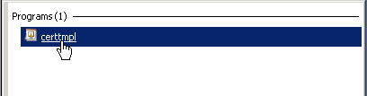

2. Next, you will clone a template to use, the one that most closely matches VMware’s requirements is the Web Server template. Right click on the template and select Duplicate Template. When prompted, you will select Windows Server 2003 enterprise. I noticed that when I clone a template as Windows 2008 it doesn’t show up when signing the certificate.

    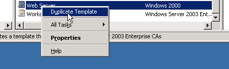

    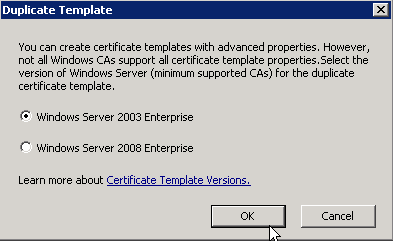

3. Provide a Template display name. Then click on the Extensions tab.

    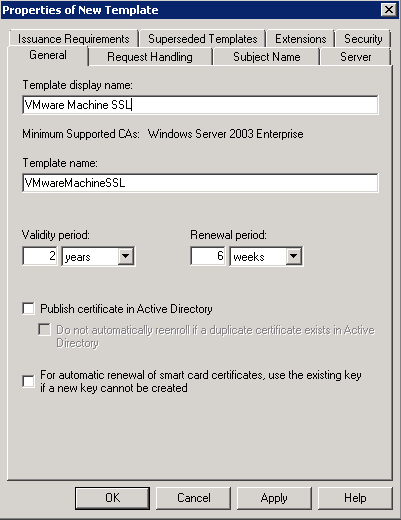

4. Click Application Policies then click Edit. Highlight Server Authentication and select Remove then hit OK.

    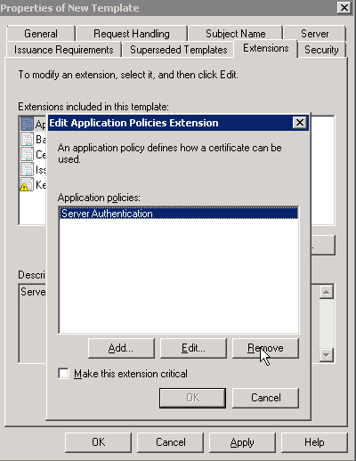

5. Select Key Usage then click Edit. Click the checkbox next to Signature is proof of origin (nonrepudiation) then hit OK.

    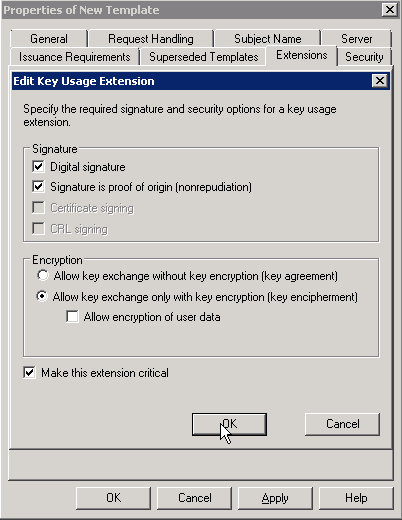

6. Click OK again to finish the template creation. You should now see a new template created. If you are not creating a template for VMCA as a subordinate CA, go ahead and skip to the very bottom to assign the templates for usage.

    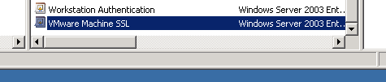

## Template for Subordinate CA

1. Duplicate the Subordinate Certification Authority, and ensure to use a Windows 2003 template as in the previous section. Provide a Template Display Name and .. Important: make sure to check in Publish certificate in Active Directory

    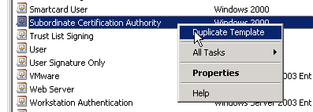

    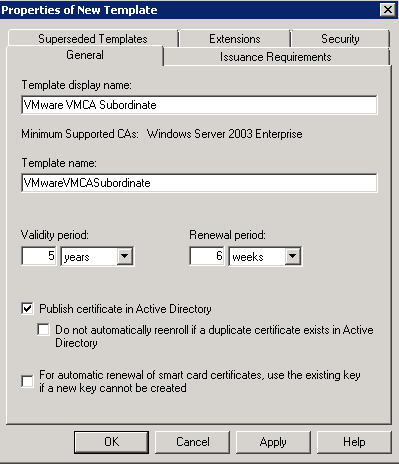

2. Click on the Extensions tab and then edit Key Usage. Ensure Digital Signature, Certificate signing, CRL signing and Make this extensions critical are checked. By default, these should already be checked, but it’s important to confirm. Finally, go ahead and click OK to create the template.

    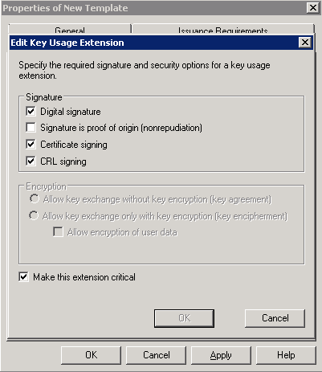

## Assign template for usage

Finally, you will need to assign these templates for use. This will need to be done for both the templates you have created. If you don’t do this step, you will not be presented with the templates you created as an option when signing the CSR files. To complete this step you will need to open the Certificate Server gui by navigating to **Start** and typing **certsrv.msc**. Once that is open, expand out the CA Server and right click Certificate Templates and select **New -> Certificate Template to Issue**.

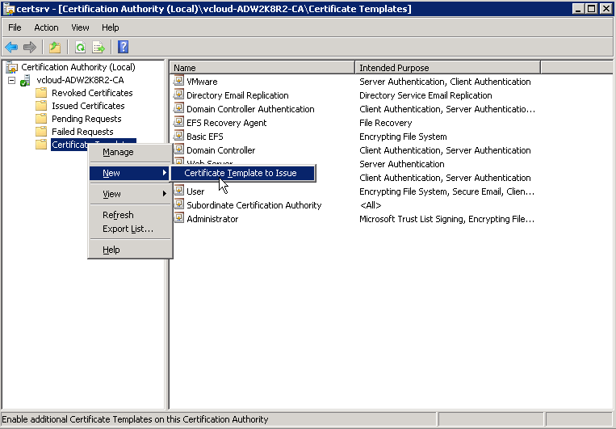

Select the certificates that you created, then click **OK**. You are able to select multiple certificates so feel free to do them both in one step.

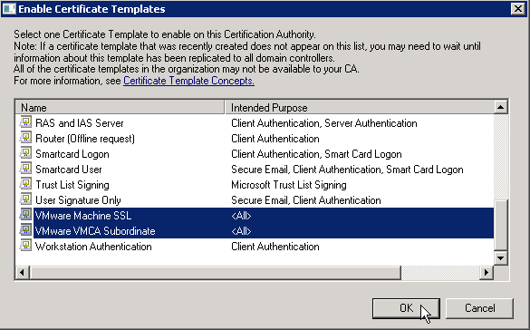
